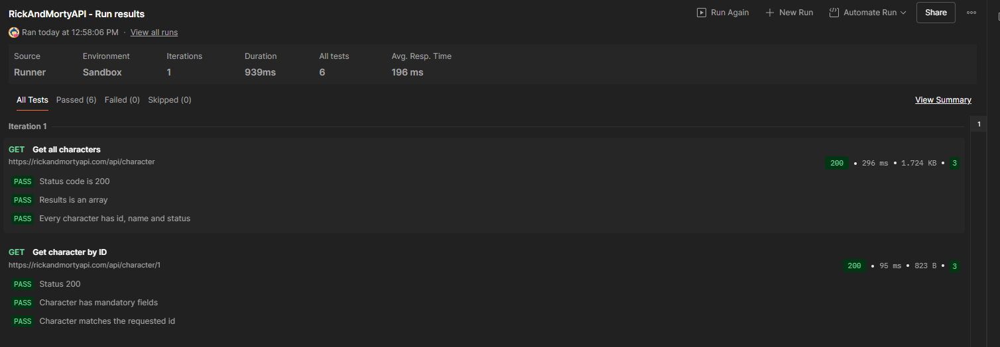

# Informe de implementación: Recursividad, pruebas con JUnit, CI/CD con GitHub Actions y pruebas de API con Postman

## 1. Introducción
En este proyecto se desarrolló un programa en **Java** orientado a demostrar el uso de recursividad en tres niveles: `factorial`, `multiplicación` y `suma`.  
Posteriormente, se construyó un conjunto de pruebas unitarias con **JUnit 5**, incluyendo casos parametrizados y validaciones de tipo y de resultado.  
Finalmente, se integró el repositorio con **GitHub Actions**, definiendo un flujo de integración continua (CI) que separa claramente las etapas de compilación, pruebas, empaquetado y ejecución de la clase principal.  
Adicionalmente, se exploraron herramientas de generación de reportes de pruebas en formato HTML, aunque no se incluyeron en la versión final del pipeline.  

En una fase posterior, se añadieron **pruebas de integración de API** utilizando **Postman** con la API pública de *Rick and Morty*, para ilustrar la validación de endpoints externos y complementar las pruebas unitarias en Java.

---

## 2. Implementación de la función recursiva
El programa implementa la función **factorial** utilizando un esquema de **recursión anidada en tres niveles**:
1. `factorial(n)` se define en términos de una **multiplicación** recursiva.
2. La **multiplicación** se resuelve a través de **sumas recursivas**.
3. La **suma** se convierte en el nivel más básico de la recursión.  

De este modo, se ilustra cómo un problema matemático aparentemente simple puede descomponerse en subproblemas recursivos más elementales.

---

## 3. Pruebas unitarias con JUnit 5
Se diseñaron pruebas unitarias para validar el correcto funcionamiento del algoritmo recursivo. Entre las técnicas utilizadas destacan:
- Pruebas parametrizadas con `@ParameterizedTest` y `@CsvSource`, permitiendo ejecutar múltiples casos con distintas entradas y resultados esperados.
- Validaciones de tipo (`assertInstanceOf`) para garantizar el tipo de retorno.
- Validaciones de resultado (`assertEquals`, `assertThrows`) para verificar valores y manejo de errores.
- Combinación de pruebas clásicas unitarias y parametrizadas para incrementar cobertura y robustez.

---

## 4. Integración continua con GitHub Actions
Se configuró un flujo de CI en GitHub Actions con pasos separados para facilitar trazabilidad y diagnóstico:
1. **Compile only**: compila el proyecto sin ejecutar tests.  
2. **Run tests**: ejecuta las pruebas unitarias con JUnit (salida detallada en consola).  
3. **Package (skip tests)**: empaqueta el proyecto en `.jar` sin volver a ejecutar tests.  
4. **Run main class**: ejecuta la clase principal (`com.ejemplo.App`) dentro del workflow.  

Esto permite detectar rápidamente en qué etapa ocurre un fallo y hace el log de CI más legible.

---

## 5. Exploración de herramientas de reporte
Se evaluaron opciones para generar reportes HTML y más detallados:
- Surefire Reports (HTML).
- JUnit Console Launcher (detallado por consola).
- JaCoCo (cobertura de tests) y consumo por SonarCloud.
Finalmente se priorizó mantener la salida en consola para simplicidad, dejando la generación de HTML como opción futura.

---

## 6. Pruebas de API con Postman (Rick and Morty API)

### 6.1 Creación de la colección
Colección: `RickAndMortyTests`  
Endpoints incluidos:
- `GET https://rickandmortyapi.com/api/character/` — lista de personajes.
- `GET https://rickandmortyapi.com/api/character/{{id}}` — detalle de personaje (variable de colección `id`).

### 6.2 Tests creados (descripción)
**Para `GET /character/`** se añadieron los siguientes tests (describe lo que debes pegar en la pestaña *Tests* de Postman):
1. Verificar que el status code sea `200`.
2. Verificar que la propiedad `results` existe y es un array.
3. Verificar que cada objeto dentro de `results` tiene las propiedades mínimas: `id`, `name` y `status`.

```javascript
pm.test("Status code is 200", () => {
    pm.response.to.have.status(200);
});

pm.test("Results is an array", () => {
    const jsonData = pm.response.json();
    pm.expect(jsonData.results).to.be.an("array");
});

pm.test("Every character has id, name and status", () => {
    const jsonData = pm.response.json();
    jsonData.results.forEach(char => {
        pm.expect(char).to.have.property("id");
        pm.expect(char).to.have.property("name");
        pm.expect(char).to.have.property("status");
    });
});
```

**Para `GET /character/{{id}}`** se añadieron los siguientes tests:
1. Verificar que el status code sea `200`.
2. Verificar que el personaje tenga los campos `id`, `name`, `status` y `species`.
2. Verificar que el `id` devuelto en la respuesta coincide con el valor de la variable de colección `id`.
```javascript
pm.test("Status 200", () => {
    pm.response.to.have.status(200);
});

pm.test("Character has mandatory fields", () => {
    const jsonData = pm.response.json();
    pm.expect(jsonData).to.have.property("id");
    pm.expect(jsonData).to.have.property("name");
    pm.expect(jsonData).to.have.property("status");
    pm.expect(jsonData).to.have.property("species");
});

pm.test("Character matches the requested id", () => {
    const jsonData = pm.response.json();
    pm.expect(jsonData.id).to.eql(parseInt(pm.variables.get("id")));
});
```

### 6.3 Variables de colección
Se creó la variable de colección:
- `id` — valor entero para parametrizar el endpoint `/character/{{id}}`.

### 6.4 Ejecución y documentación de resultados
La colección puede ejecutarse con el **Collection Runner** de Postman.  
Para documentar la ejecución en el repositorio se añadieron los siguientes artefactos, almacenados junto al presente informe:

- `RickAndMortyAPI.postman_test_run.json`: export del resultado del run en formato JSON.  
- `EvidenceRun.png`: captura de pantalla del Runner mostrando todos los tests exitosos.  

Evidencia visual de la ejecución:  



---

## 7. Conclusiones
- El proyecto muestra la recursividad en cascada (factorial → multiplicación → suma) como ejercicio didáctico de descomposición funcional.  
- JUnit 5 permitió crear tests parametrizados y validar tipos y excepciones con claridad.  
- GitHub Actions ofrece un flujo CI claro separando compilación, pruebas, empaquetado y ejecución, lo que facilita el diagnóstico.  
- Se exploraron reportes HTML y herramientas de cobertura; por ahora se mantiene la simplicidad con logs en consola.  
- La adición de pruebas de API con Postman amplía el alcance de la validación, permitiendo comprobar interacciones con servicios externos y dejando la puerta abierta para ejecutar estas colecciones en CI (con Newman) si se desea.

---
